# 文化产业导论2019秋Slides要点总结（BY SULLEY）
## 第一讲：文化、创意与产业：文化产业关键词
文化：讲求内涵和厚度，强调历史的沿袭  
创意：诉求感动深度，是生成作品的能力  
产业：追求接受广度，强调经济的规模与技术的适用  

### 文化
什么是文化：文化或文明就是人作为某个社会的成员所获得的知识、信仰、态度、价值、风俗、艺术、道德、法律、习惯等一切能力或习性的总和。

文化的意蕴：人类在历史发展过程中所创造的物质财富和精神财富的总和，特指精神财富；同一历史时期的不依分布地点为转移的遗迹、遗物的综合体；同样的工具、用具，用同样的制造技术等，是同一文化的特征；运用文字的能力及其一般知识水平

文化的定义：
- 文化的第一个定义是在人类学和社会学架构下经常用到，用来描述任何群体所共有的独特认同。
- 文化的第二个定义是比较实用导向的，指人类从事的某种活动，其产物与人类生活的知识、道德与艺术层面有关。
- 文化的第三个定义是更精确的第二定义，来自于人类活动的某些特征，具有客观定义：（1）在生产活动中融入创意；（2）活动涉及象征意义的产生与传达；（3）该活动的产品有知识产权。

文化的价值：膜拜价值、展示价值、体验价值  
文化价值的特点：时间上的可变性、空间上的差异性、人性上的可通约性

文化的观念：一元思维、二元思维（文化事业、文化产业）、多元思维

### 创意
创意的定义：创意强调现实的创新。“创造”是发明，“创新”纳入了经济活动，“创意”是“创出新意”，包含激发创意本身的欲望

创意的内涵：创意进程要求我们把不熟悉的参考框架连接起来，利用不同的思维形式。把不同的人群连接起来。创意内容应该兼具新奇感和价值型。要将创意定位于意图、行动和结果的背景环境之中。创意结果连接了于其中发生的领域或领地。创意想法转换了在它们周围的背景环境或“概念化空间”，打开了一种面向未来创意的崭新的可能性。个人的创造力洞见有了集体性的结果。  

作为过程的创意（创意发生后的动态过程和互动影响）、作为内容的创意（包含着创意工作性定义的基本要素）、作为结果的创意（创意产出或创意影响更实用的评估）

四大内部要素：发现、专注、宽松、集中  
四大外部要素：展望、互动、涉猎、创造  
战略创新、创意企业家精神、创意领导力、创意组织

### 产业
产业的定义：在工业革命之前，指一种人类特质；在此之后，描述人类的生产制造体制与一般活动

产业的特征：（1）规模化生产；（2）商业化运营

产业的效用——艺术性与商业性：（1）文化产业的艺术性是文化产品相互区别的艺术属性，是产业化的基础；（2）产业化的问题出发点：不是文化产品的艺术性和文化内涵，而是从商业化的角度——面向市场需求，企业经营行为，高新技术手段，产业集群效应；（3）文化艺术的商业化和产业化有助于文化艺术发展，创新是主要手段：形式创新和内容创新。

不同说法：文化工业、文化产业、创意产业、文化创意产业、版权产业、内容产业、传媒产业、娱乐产业。

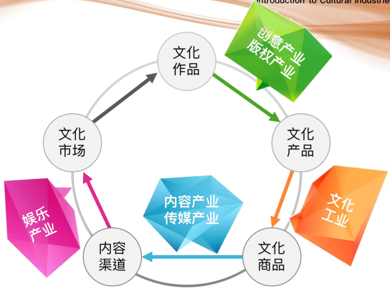

**文化**是人类的精神财富，是空间的聚集和时间的积累。创意是人类文化定位的一个重要部分，强调创造性和知识产权，可被不同形式表现。  
**文化产业**适用于那些“以无形、文化为本质的内容，经过创造、生产与商品化结合的产业”。  
**文化产业**的生产内容典型地受到著作权保护，可以采用产品或服务形式表现。

## 第二讲：文化产业的特征、内涵与外延
### 文化产业的门类
- 第一部分：产品层，以精神消费为直接目的、大多以版权为主要的存在方式的行业。包括音乐表演艺术、视觉艺术、新闻出版、广播影视、动漫游戏、工艺古董、数字内容七项
- 第二部分：服务层，为其他行业提供创意服务的行业。包括产品设计、公关广告、节庆会展、咨询服务四项
- 第三部分：交叉层，与科技、旅游、体育、文化、教育等相关的行业。包括文化旅游、体育休闲、文化设施、教育培训，其他经中央机关认定的行业五项。

### 文化产品的特征
文化产业的基本条件：强调原创性、注重产业链的扩展和产值的提升、推动文化产品的市场化、重视知识产权的保护  
文化产品的形态：在地型、在场型、在线型  

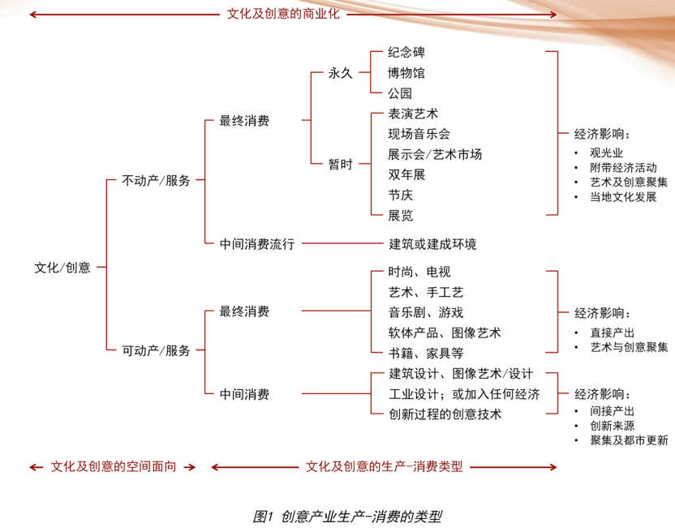

创意产品具有需求的不确定性；  
创意产业的创意者十分关注自己的产品；  
创意产品不是单一要素的产品，其完成需要多种技能；  
创意产品特别关注自身的独特性和差异性；  
创意产品注重纵向区分的技巧；  
创意产品的存续具有持久性与营利的长期性。  
其中强调：创意需求、创意产品，创意人才  

文化产品与一般商品的不同点：
- 文化产品的生产带有明显的价值特征
- 文化产品很难实现等价交换
- 文化产品使用价值的实现程度不同
- 文化产品的消费带有明显的主体特征

**文化产品的特征**：（1）满足的是精神消费；（2）传播的大众文化，具有时尚化、娱乐性和互动性的特点；（3）能够被批量化生产和大规模传播；（4）创造了文化符号，被知识产权化，成为文化品牌，可以被授权经营

文化产业的本质：（1）就要个人创意和创意阶层，是一种智慧产业、知识产业、版权产业和审美产业，是对本地传统文化的艺术创新；（2）基于现代高新技术和新媒体，是一种传媒产业和内容产业，可以大规模复制和批量化生产；（3）面向现代市场和国际市场，要形成规模化的文化市场和文化消费；（4）产品经营与企业经营相结合，产业经营与资本经营结合，提升长期、整体的企业价值经营

文化产业金字塔模型：文化产业<->([T：技术、人才、环境宽容度]<->[A：文化资源]<->[E：区域经济、商业模式])

文化产业的发展动力：资源动力（内动力）和产业动力（外动力）。资源动力主要是创意人才和文化资源；产业动力主要是技术、市场、企业。

文化产业的价值本质：创新价值，象征价值，知识产权，产业价值  
**创新价值——巧创新驱动**：硬实力（坚实的制造基础）与软实力（动人的文化底蕴）的结合  
**象征价值——故事驱动**：膜拜价值（感官体验）、展示价值（情感体验）、体验价值（精神体验）  
**知识产权价值**：商标、专利、著作权、工业设计  
**全产业链价值**：

文化产业的发展趋势：（1）政策趋势：文化治理、宽松量化与融合发展；（2）商业趋势：价值成长、生态化经营与社会型企业；（3）消费趋势：时尚消费、体验消费与青少年消费主体；（4）技术趋势：文化科技融合、数字化整合与移动互联网生态链；（5）融合趋势：产品价值转化、产业结构优化与区域价值融合

## 第三讲：文化产业的缘起、历程与模式
文化产业发展的背景：（1）在高科技、数字化的条件下，物质需求与精神需求的平衡已成为人类社会生存发展的必要条件；（2）随着社会生产力的发展和人类物质活逐步富裕，人们的闲暇时间大大增加；（3）世界各国经济出现重大变化：商品的文化价值、符号价值逐渐超过商品的使用价值和交换价值；（4）在新的时代条件下，资本形式也发生重大变化，单一的货币资本逐渐转化为货币资本、文化资本、社会资本和象征资本等多元资本形式

文化产业的世界状况：市场驱动型——美国，资源依托型——英法德，政策引导型——韩日中  
文化产业的发展模式：
- 基于文化产业政策的发展模式：美国的无为而治（多元资助，以社会为主），英国的一臂之距（简洁拨款），法国的担保融资，韩国的投资组合
- 基于经济增长方式的发展模式：外生型文化产业发展模式——以来外部文化产品的输入和对外文化产品的输出；内生型文化产业发展模式——基于本地创意集聚优势，以内需为市场基础的文化产业发展模式

文化产业的中国历程：2012年是我国文化产业发展的分水岭；区域发展不均衡——东高西低，省际差距大；文化产业单位规模小，人均创利少；文化产业对国民经济贡献低于发达国家  
行业发展：电影业——日益成熟，电视业——强势部门，出版业——寻求突破，艺术品业——日益活跃  
区域发展：东强西弱，中西部优势独特

文化产业的发展模式：基于绝对优势理论的资源型文化产业发展模式（绝对优势的文化资源、膜拜价值为开发对象、门票经济为收入模式，亚当斯密）；基于比较优势理论的制造型文化产业发展模式（劳动力原材料、科技、利润率5~10%，大卫-李嘉图）；基于增长极理论的生态型文化产业发展模式（单中心突破、产业传导、产业园区，弗朗索瓦）；基于竞争优势理论的内容型文化产业发展模式（要素条件、需求条件、企业竞争、辅助产业状况、政府、机会，迈克尔-波特）；基于竞争优势理论的平台型文化产业发展模式（创新能力、管理模式、核心竞争力、网络技术、平台经济，迈克尔-波特）

## 第四讲：文化调查：文化产业的研究方法
什么是问卷调查法：调查者通过问卷对调查对象的某些社会生活状况及其对于某些社会现象或行为的看法、态度、状况等方面进行询问并记录的调查方法。调查者使用事先设计好的标准化的问卷收集信息，对调查对象进行研究分析

调查问卷：
- 作用：描述、解释、预测
- 分类：结构式、非结构式
- 方式：面对面、邮件、电话、网络
- 原则：多实践、多自测
- 步骤：提出问题、确定对象、初稿、收集意见修改、预投放、修改定稿、投放

## 第五讲：文化资源：文化产业的驱动要素
文化资源->文化项目->知识产权->资本资产->资产产权->产权金融->文化品牌

### 文化资源的定义、种类和特点
文化资源的定义：一般是指具有文化特征和人类进步活动痕迹，具有人文的和传统价值的一类资源，包括历史遗迹、民俗文化、地域文化、乡土风情、文学历史、民族音乐、宗教文化、资源风光等。文化资源能力不是文化产业发展能力。文化资源是文化产业发展的基础，但不是所有的文化资源都可以进行产业化经营。现代社会与后现代社会的区别，在于工业主义向文化主义的转向，在于生产目标从无限制的开掘自然资源转向文化资源。

文化资源的种类：
- 物质文化资源：物质文化遗产是具有历史、艺术和科学价值的文物，包括历史文物、历史建筑、人类文化遗址等文化景观
- 非物质文化资源：非物质文化遗产是指各种以非物质形态存在的与群众生活密切相关、世代相承的传统文化表现形式，包括被各群体、团体、有时为个人视为其文化遗产的各种实践、表演、表现形式、知识和技能及其有关的工具、实物、工艺品和文化空间。
- 自然文化资源：
- 保护为主、抢救第一、合理利用、传承发展

文化资源的特点：（1）文化资源是一种无形的柔性化资源；（2）文化资源是一种需求非稳定的不确定性资源；（3）文化资源是一种在产生、传播和接受过程中存在变化的差异性资源；（4）文化资源是一种情境内生性的环境适应性资源；（5）文化资源是一种基于人性需求的可通约性资源

文化资源的构成要素：品相指标、价值指标、效用指标、发展预期指标和传承能力指标
- 品相要素：文化特色、保存状态、知名度、独特性、稀缺性、分布范围
- 价值要素：文化价值、时间价值（历史久远性和稀缺性、比较优势、可替代性）、消费价值、保护等级、关联价值
- 效用要素：社会效用、经济效用、民间风俗礼仪、公共道德、资源消费人群、资源市场规模等
- 发展预期：经济发展水平、交通便利度、生活服务能力、商务服务能力等
- 传承能力：资源规模、资源综合竞争力、资源成熟度、资源环境等

文化资源的评估指标（SMART原则）：明确性原则：Specific，可衡量原则：Measurable，可达成原则：Attainable，相关性原则：Relevant，时限性原则：Time-bound  
社会效益与经济效益

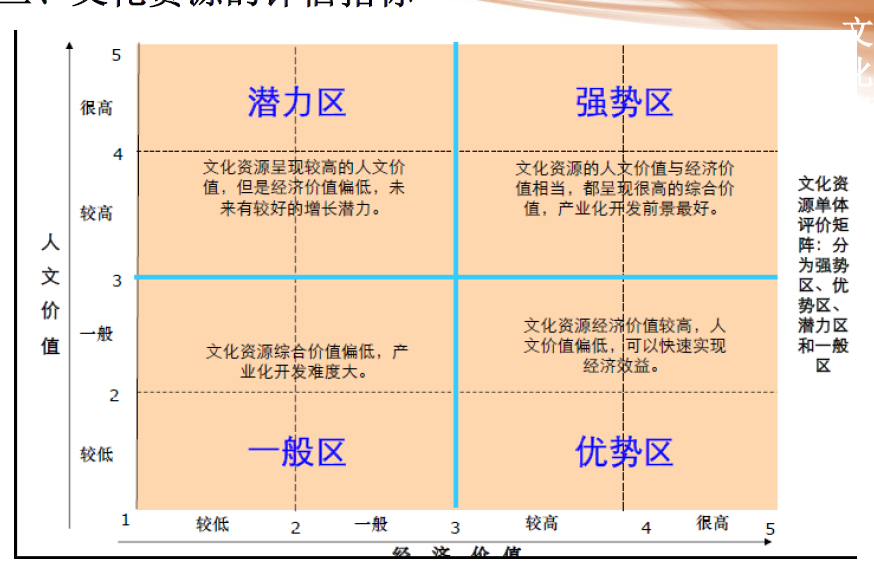

文化资源的开发模式：**基础性开发和深度性开发**。基础性开发是一种传统型开发，以基础型和制造型文化产业为发展模式。文化资源的基础性开发包括了文化旅游开发模式、主题公园开发模式、节庆会展开发模式和文化地产开发模式等。文化资源的深度性开发模式是一种创新型开发，以内容型文化产业和生态型文化产业为发展模式。文化资源的深度性开发模式包括创意产品开发模式、科技创新开发模式、特色产业带开发模式、生态博物馆开发模式和文创造镇开发模式等。
- 文化旅游开发模式：支持文化旅游节、打造旅游演艺产品，开发文化旅游产品，打造文化旅游品牌，鼓励旅游度假区的连锁经营
- 主题公园开发模式：据特定的主题创意，主要以文化复制、文化移植、文化陈列以及高新技术等手段、以虚拟环境塑造与园林环境为载体来迎合消费者的好奇心、以主题情节贯穿整个游乐项目的休闲娱乐活动空间
- 节庆会展开发模式：以传统节庆、定期会展为载体和平台，在一段时间内通过对区域文化资源的全方位整合和综合性发掘，最终实现节庆经济和会展经济综合效益
- 文化地产开发模式：文化地产也是文化资源寻求地产载体所尝试的一种文化创新。文化地产的典型特征是将文化艺术融入进地产开发，以主题社区、文化小镇、艺术商场、旅游地产等形式提高地产业的附加价值，是现代服务业的一种创新业态
- 创意产品开发模式：文化资源的深度性开发要结合创意、科技等手段，挖掘文化资源的符号象征系统和精神价值系统，通过影视、动漫、音乐、舞蹈等文化产品的开发模式。文化资源的创意产品开发模式是一种可持续、可循环的资源开发模式。文化资源的基础性开发是以服务为中心、以空间为载体的文化资源开发模式，文化资源的深度性开发是以产品为中心、以渠道为载体的文化资源开发模式
- 科技创新开发模式：借助科技手段，发挥科技创新对文化创意的重要引领作用，凸显文化产业高附加值和高科技含量的新经济特征，深入挖掘优秀的传统文化资源和深厚的文化底蕴，推动动漫游戏等产业优化升级，打造民族品牌，推动动漫游戏与虚拟仿真技术在设计、制造等产业领域中的集成应用
- 特色产业带开发模式：特色园区开发模式是以特色文化资源为开发对象、以文化产业集聚园区为开发型态、以发展特色文化产业为目的的文化资源开发模式。特色文化资源一般是指在某个特殊的民族和区域内独具特色的自然生态资源、民俗风情资源和历史人文资源，特色文化产业包括特色文化旅游、特色工艺美术、特色表演艺术、特色节庆会展等。由于特色文化资源具有区域集聚性、生态发展性和草根生活性等特点，其开发的模式特别借助于园区、产业带和特色功能区的空间形态，实现区域内文化资源开发的过程互助、开发的成果共享
- 生态博物馆开发模式：生态博物馆不同于传统文物典藏的博物馆，而是山明水秀的物理场景和人们行住坐卧的起居空间连结在一起，将某个特定的区域整体作为一座没有围墙的活的博物馆。文化资源的生态博物馆开发模式是一种保护性开发，实现了文化的原生地保护，维护了文化生态的可持续发展
- 文化造镇开发模式：文化资源的文创造镇开发模式是城镇化发展理念的根本转变，也是大文化资源开发思路的观念转变。“文创造镇”以文化为出发点和目的地，以“文化立镇”为发展理念，以“经济搭台、文化唱戏”为行动主轴，将“人、文、地、景、产”五个面向作为城镇化发展的主要着力点，“找到土地草根的力量”，找到城镇化发展的文化宝藏，转变为城镇化管理和文化建设的核心资源，最终通过“文化故事”塑造城镇的文化品牌

## 第六讲：文化技术：文化产业的价值创新
文化技术的历史变迁：印刷技术、电子影像技术、计算机数字技术

文化技术的发展现状：
- 按照文化技术形塑文化产业的具体形态：文化技术可以分为文化物品制造技术、文化信息传播技术和文化服务技术三类
- 按照文化技术实现文化产业的文化功效来分：文化技术可以分为文化创作与表现技术和文化传播技术
- 按照文化技术自身的发展生命周期来分：文化技术可以分为传统文化技术、现代文化技术和新兴文化技术三类，大致与新闻出版、广播影视等大众传播技术、互联网信息传播技术和移动互联网信息传播技术相对应
- 新兴文化技术正在改变文化产业的生产方式，新兴文化技术正在改变文化企业的商业模式，新兴文化技术正在改变人类社会的生活方式

文化技术的价值反思：
- 机械技术与复制艺术：
  - 机械复制艺术引发的新情况：a、技术复制比手工复制更独立于原著。b、呈现意义上，突破了肉眼及传统时空观念。c、通过机械复制，强化着原真性。d、传播意义上，开始面对“大众”。
  - 机械复制艺术品的缺失：a、丧失了一种与“历史”的关系；b、没有成为“历史证据”，复制品丧失了作为艺术品的权威性
  - 机械复制时代艺术呈现的变化：有光晕->无光晕，有自主性外观->无自主性外观，膜拜价值->展示价值，礼仪功能->政治功能，凝神专注地接受->消遣接受，有限参与->大众参与
  - 机械复制对艺术的影响：（1）带来了艺术形式的革新（新的机械复制艺术的出现，最终导致了传统艺术的解体；艺术逐渐失去了个性和个人情感，它己成为一种消费的商品，成为赢利的手段）；（2）改变了艺术感知方式；（3）扩展了接受者的层次和数量（复制艺术可以广泛传播，平民化的复制艺术能够从空间上和人性上满足大众接近艺术的强烈愿望,获得了现实的活力）。**从膜拜价值到展示价值**。
- 文化工业的大众启蒙：从精英文化到大众文化（法兰克福学派）
  - 发展：（1）准备期（1923~1930年）成立法兰克福社会研究所，以研究马克思主义为宗旨，西方和东方马克思主义思潮的联结点，不同的马克思主义思潮交汇或对话的场所；（2）创立早期/美国时期：1930年至1949年间，社会研究所确定了明确的研究方向，即建立社会批判理论或批判的社会理论；（3）中期/鼎盛时期：1949年至60年代末，重新回到德国，西德活动的时期。在60年代末席卷欧洲的学生和青年造反运动中获得了极高的声誉，产生了十分巨大的影响；（4）晚期：70年代，第一代主要代表人物相继谢世；观点分歧。学者以个人身份活跃在国际学术界，而法兰克福学派作为一个强有力的学派的历史基本上已经终结
  - 法兰克福学派的理论方案：对经济决定论的批判；吸收了佛洛依德理论，深化对社会主体的理解；对“大众文化”和文化操纵的批判；对“工具理性”的分析；发展了建立在人的特殊性思想的社会批判理论
  - 《文化工业：作为大众欺骗的工具》：（1）文化工业的存在基础（资本）注定其不可能实现自由创造（市场价值）；（2）文化工业使人的个性逐渐趋于消亡（商品价值）；（3）文化工业的基石注定其无法实现艺术的超越性；（4）先进技术的采用降低了文化产品的艺术价值（技术生产）；（5）文化工业的创作必然走向程序化（规模生产）；（6）文化工业产品消费者的独立判断能力日益消失。
  - **大众文化与文化工业**：大众文化(Mass Culture)：作为世俗文化，萌生于启蒙时代，发育于19世纪巴黎，扩变为美国人追捧的流行艺术(Pop Arts)。文化工业(Culture Industry)的定义是:(l)它针对消费需求组织生产;(2)它仰仗先进技术，实行集中管理;(3)它混淆雅俗高低，消解艺术真理;(4)它奉大众为上帝，大众却是被它算计的客体。
- 科学与艺术的融合：从科学技术之美到创意生活
  - 德国哲学家海德格尔、英国科学家查尔斯·斯诺（两种文化）、叶朗教授（第三种文化）、李振道（“物艺相通”和“科艺相通”）、弗拉基米尔·纳博科夫、威廉·莫里斯（艺术和技术结合，现代设计之父）
- 审美经济时代的消费法则：基于身体美学的体验价值
  - 美国实用主义美学家理查德·舒斯特曼从身心合一出发提出了“身体美学（Somaesthetics）”，让身体成为日常生活的中心，让美学发挥日常生活的引领作用。

文化科技融合的巧创新（推动产业融合，坚决捍卫知识产权）：
- 硬创新：为产品创新、过程创新、组织创新、营销创新（产品的功能差异创新
以专利的形式得到保护）
- 软创新：以审美变革为主导的文化创新（产品的审美价值创新
以版权等形式得到保护）

## 第七讲：文化资本：文化产业的价值逻辑
### 文化研究的理论范型：法兰克福到伯明翰
- 宗旨：研究文化形式、文化实践和文化机构及其与社会和社会变迁的关系。内容：主要涉及大众文化及与大众文化密切相关的大众日常生活。对象：广泛涉及电视、电影、广播、报刊、广告、畅销书、儿童漫画、流行歌曲，乃至室内装修、休闲方式等。
- 奠基人物与著作：霍加特：《文化的用途》，汤普逊：《英国工人阶级的形成》
- 核心人物与著作：雷蒙·威廉斯：《文化与社会》《漫长的革命》；斯图加特·霍尔：《电视讨论中的编码和译码》《文化研究：两种范式》《“意识形态”的再发现：媒介研究中被压抑者的回归》
- 现代**文化研究**的特征：非文学艺术研究，尽管有些相似；关注现实问题，与社会联系紧密；有极大开放性，不受学科限制；研究态度上保持其批判的精神。
- **编码、解码**：编码的层次：1、故事中的人物的编码——死亡/存在，合理/合法；2、电影导演的编码——人性在（上帝死后的）“个人”如何可能/可不可能？3、法兰克福：解读“文化工业”/资本的编码
- 重要的不仅仅是要了解**信息/意义是如何被生产出来的**（编码），更重要的是去了解**受众意义构建的方式**，研究这些信息/意义是如何被解码的。
- 编码：素材与意义第一次断裂与重构；解码：素材与意义第二次断裂与重构
- （1）编码和解码的符码并不一定是完全对称的，对称程度/地位决定了符码在传播过程中的理解/误解的程度；（2）依赖于编码者/生产者和解码者/接受者所处位置之间建立的对称性/对等关系的程度、地位的差异，也依赖于符码间同一性的程度；（3）对称性与否，视信息转换/脱离话语形式的环节而定
- 解码过程分析——**霍尔模式**：假设三种不同的地位关系，来建构各种解码过程；
  - 主导-霸权的地位：特点——解码者用信息编码的参照符码将信息解码，在主导符码范围内进行操作；效果——完全明晰的传播
  - 协商的符码：特点——在协调的看法内解码包含着相容因素与对抗因素的混合；效果——某种程度上的误解
  - 对抗的符码：特点——解码者虽然理解话语的字面和内涵意义的曲折变化，但是以一种全然相反的方式去解码；效果——对抗的“意义的政治策略”或者“话语斗争”

### 文化资本的形式与功能
皮埃尔·布尔迪厄，《阿尔及利亚人》《教育、社会与文化中的再生产》《实践理论大纲》《实践的逻辑》《文化生产的场域》《语言与符号权力》
- 核心概念：分析文化象征领域与社会空间的结构性对应。他对文化的深刻理解，体现在他建立的**“场域——习性——资本”三位一体概念模式**上
  - 资本：经济资本、文化资本、社会资本、象征资本。（1）每一场域都具有各自占主导性的资本，占优势的资本形式决定了场域的特有逻辑（权力场域：政治、经济、社会资本）；（2）资本本身决定场域中的布局（资本的总量和结构）
  - 习性：个体在家庭、学校、社会环境中形成一套性情倾向，个体有意无意地将社会外在规则、社会结构图式内化进性情、习惯之中，形成调节行动者和其生存其中的场域之间关系的习性。两个基本特点：（1）是一种结构化的结构(Structured structure)，这说明习性是被场域和社会空间所结构的；（2）是能生成结构的结构(structuring structure)，这是布尔迪厄所一直强调的习性的生成作用，正是这种生成性作用才能在社会条件的限定之下产生多种多样的具体的实践类型
  - 场域：一个场域可以被定义为在各种位置之间存在的客观关系的一个网络(network)，或一个构型(configuration)。正是在这些位置的存在和它们强加于占据特定位置的行动者或机构之上的决性因素之中，这些位置得到了客观的界定，其根据是这些位置在不同类型的权力(或资本)一一占有这些权力就意味着把持了在这一场域中利害攸关的专门利润(Specific profit)的得益权一一的分配结构中实际的和潜在的处境(situs)，以及它们与其他位置之间的客观关系(支配关系、屈从关系、结构上的对应关系，等等)。场域的特性：（1）斗争性：场域是行动者争夺有价值的支配性资源的空间场所，这是场域的最本质的特征；（2）自主性：次生场域并非场域的功能性组成部分，场域与场域间没有直接的决定关系；（3）同源性：行动者的内在结构（习性）与社会结构之间是同源的，处在不同场域中的处于相似地位的行动者可能分享相似的习性，不同场域之间的关系性结构的相似性。

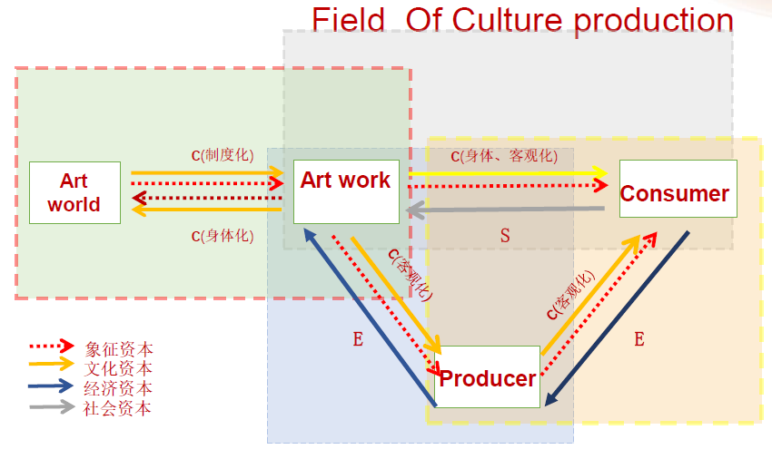

### 文化资本的转换机制
（1）文化资本是一种非物质资本和以财富为表现形式的象征资本，是人类财富创造的重要生产要素之一；（2）文化资本是一种象征资本，通过象征资本实现与经济资本、社会资本的资本转换；（3）人类社会的物质生产活动、精神生产活动和社会活动是一个有机联系的人类活动的整体，不仅文化资本的不同存在状态之间，而且不同资本形态之间都会发生互相转换；（4）惯习塑造了场域，场域也主导了惯习，惯习让主体拥有了不同的文化资本，不同的文化资本主宰了场域的权力结构。（5）文化资本具有经济功能，可以转换为经济资本；（6）文化资本处在一种制度化的社会网络中，即可以直接转化成社会资本，也可以借助社会资本，扩大经济资本；（7）文化资本、社会资本与经济资本之间相互转换的基础在于象征资本；（8）文化资本很容易与人力资本和创意资本的概念相混淆；（9）文化资本的形成是一种社会制度的安排结果，即在财产权制度的规训下形成文化财产

### 文化资本的产业特征
（1）文化资源是一种存量的文化资本，文化资本是一种流量的文化资源；（2）文化资本具有一定的物化形式，包括在地固定化、在场产品化和在线无形化等三种存在状态；（3）构成文化企业可掌控的文化资本具有三种状态；（4）文化资本的价值累积是一个动态的历史的过程。（5）文化资本的价值收益是不断递增的，外延价值逐渐延伸；（6）文化资本的产业效益具有双重性，是经济价值与文化价值的高度融合；（7）文化资本的交易模式具有多元衍生、跨界渗透的特性；（8）文化产业的经营核心是文化资本，文化资本是经济结构调整和产业结构升级的驱动因素和增长源泉。

## 第八讲：文化资产：文化产业的价值评估
### 文化资产的产权特征
艺术品功能的演变：欣赏->消费->收藏->投资  
艺术市场结构的演变：一级市场、二级市场、三级市场、四级市场  
文化资产变现业务的主要环节：变现->确权->鉴定->估权->易权->变现

无形资产具有下列特征：（1）能被明辨或被清楚陈述；（2）受法律保护；（3）为私人所有权限制，且该所有权可以转让；（4）具备某种可被证明无形资产权利存在的有形证据；（5）可在某一可辨认的时点或交易中出现；（6）可在某一可辨认的时点或交易中损毁或消灭

文化资产不具实物形态，是一种非金融大多受知识权法保护具有潜在和现实的商业价值，是与收益相关文化企重要资产。  
文化资产作为一种无形资产，具有如下特征：预期性和政策性、可正可负性、模糊性、独立性、复杂性、效益性、动态性、长期性、不确定性  
文化资产的分类：销售类、技术类、艺术类、数据处理、工程类、客户类……  
**知识产权**具有以下特征：（1）无形性，代表知识产权的存在是以不可触摸或感非实体物为主；（2）专有性，知识产权赋予人拥有的排他权，将知识产权独立于公有的财产权之外；（3）复制性，能体现出相关产品的复制活动；（4）公开性，这些获取法律的保护要在使权利人拥有之前，先提出书面申请；（5）地域性，只有在某个国家或地区正式申请，才具有法律效力；（6）时间性，具有法律规定的期限。  
知识产权：专利权、商标权、著作权与邻接权、商业机密  

文化资产是一种将“历史性、社会性、共享性”的文化资源转化为文本资本、并以知识产权形式确保的现代资产，具有“现实性、独占性、排他性”的资产特征

### 文化资产的价值内涵
价值是文化资产运营与管理的基础，“价值二元性”适用于文化经济领域的所有现象，即文化资产的价值属性以文化价值和经济价值的并存为基本特征

文化产品的价值困境：经济的驱动力是个人主义的，文化的驱动力是集体主义的；经济价值总是准确的、客观的，其估值的方法是可重复性的，而文化价值总是复杂的、多元的、不稳定的，缺乏一个共同的记账单位缺乏一个共同的记账单位  
艺术品市场利润的三个价值来源：存在价值、选择价值、遗赠价值  
文化产品的价值讨论：历史价值、艺术价值、年代价值、新物价值、现今价值、科学价值、情感价值、文化价值、使用价值  
非物质文化遗产的价值体系：历史价值、科学价值、教育价值、文化价值、社会价值、经济价值、精神价值、审美价值  
文化产品的价值结构：文化产品是一种象征性商品，是一种多元价值的复合品。任何商品都包括了交换价值和使用价值，要满足消费者能感知的体验效用，无论是满足基本生理需求功价值，还是满足社会性的精神需求的文化价值，没有使用价值的商品是没有市场生命力的

### 文化价值的评估方法
（1）关系图：对研究对象进行简单的背景环境的分析，包括地理、物理、社会、人类学和其他类别的关系图；（2）深度描述：描述文化对象、环境或过程，是难以理解的现象的合理化，让我们对行为的背景或意义更加了解；（3）态度分析：参考社会调查法、心理测量法，特别评估社会及精神方面的文化价值；（4）内容分析：目标在于意义的确认与描述，适合于象征价值；（5）专家评价：在美学、历史及真实价值方面提供判断

文化产品的劳动价值论：使用价值与交换价值，Q=f(L,K,N,E)，L为劳动，K为资本，N为土地，E为企业  
文化产品的效用价值论/需求价值论：边际革命，体验效用——反映快乐和幸福的效用，马斯洛需求层次理论（生理、安全、归属、尊重、自我实现需求）  
文化产品的协商价值论：可供性回路价值论，价值锦标赛理论，场域建构型活动理论（强调人在活动中的作用，把场域运行的机制归因于不同的团队之间的社会联系和相互作用）

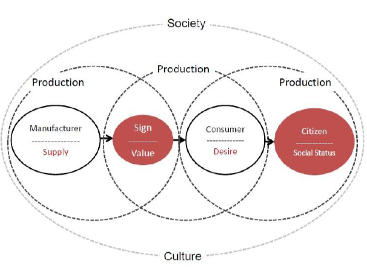

### 经济价值的评估方法
传统评估方法：成本法、市场法、收益法；现代评估方法：评等法、现金流折现法、权利金节省法、经验法、拍卖法、选择权法等  

**成本评估法**：认为知识产权的价值可直接在其建构成本中评估，知识产权的开发或购置不得低于其所贡献的经济价值，最终以文化产业链中的知识产权“生产”或“产生”成本来评定知识产权的价值。**资产评估值=重置成本-实体性贬值-功能性贬值-经济性贬值**  
**市场评估法**：文化资产的市场价值受交易事例的价值和产业可变因素的影响，可以交易价格为参照，结合宏观产业环境的影响因素进行综合评估  
**收益评估法**：在于以现值考虑文化资产的未来的预期收入，是在多种变量下产生的一种方法。透过预测文化资产在未来的经济寿命周期，于某一特定周期可以获得的预期收益，再选择合适的折现率求值  

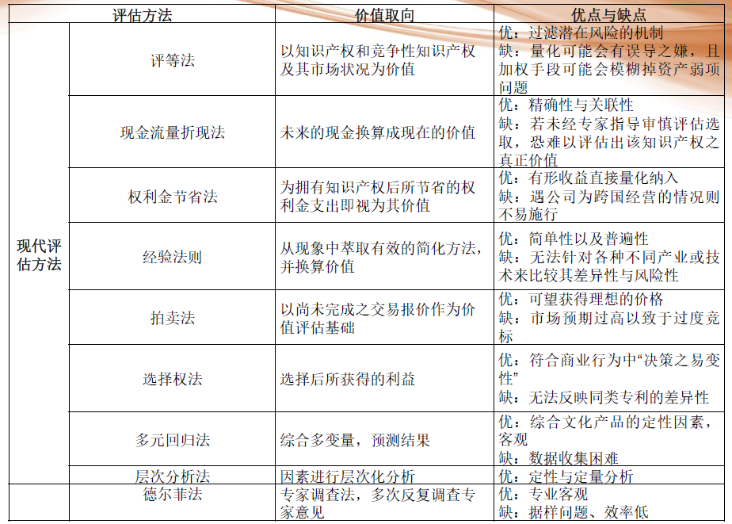

### 文化资产价值评估体系
文化资产的文化标准品：（1）好的文化产品是最重要资产之一；（2）文化产业项目与文化产品价值与非文化事件与事物的价值构成区别在于前者的知识产权与自然景观；（3）知识产权资产经常被描述为无形资产；（4）知识产权的商业核心价值在于差异性、艺术性、和服务目的的准确性；（5）文化产品带价值是一个三维的概念，即具备差异性、艺术性和服务目的的准确性三大特征，这种文化产品是有效的文化产品，或“文化标准品”  
文化资产的价值评估对象：策划方案类、广告创意类、文学作品类、工艺品类、建筑设计类、文化产业发展规划类、文化企业管理类、公共文化服务类  
文化资产价值评估指标体系结构：
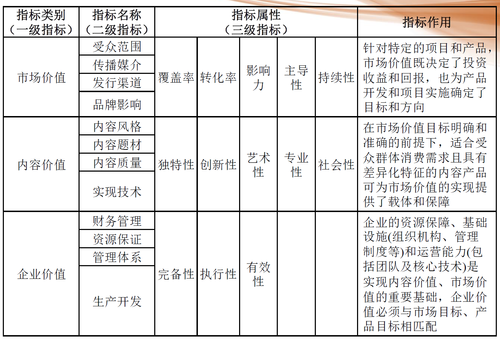  
文化资产价值评估指标评测依据：市场价值（受众范围、传播媒介、发行渠道、品牌影响），内容价值（内容风格、内容题材、内容质量、实现技术），企业价值（财务管理、资源保证、管理体系、生产研发）  
文化资产价值评估体系指标权重系数  
文化资产价值评估综合评测  
文化资产价值评估综合判定：>=3分为通过

## 第九讲：文化创意：文化产业的故事驱动
### 文化创意的故事特征
文化生产的过程也就是故事驱动的过程。故事驱动以故事为核心，运用无形的想象力把文化资源转化为文化产品，形成包括故事创作、故事改编、故事内容的跨媒体应用、跨渠道运营和跨产业融合在内的故事产业价值链，造就了庞大的文化产业和文化经济。  
“奇观化”故事讲述、“数字化”故事讲述、“社会化”故事讲述  

### 文化创意的故事原则
故事创意存在的三个问题：（1）传统文化与当代文化的隔膜；（2）精英文化与时尚文化的隔膜；（3）本土文化与国际文化的隔膜  
四条标准：（1）第一，我们的文化产业，特别是电影、电视，以及美术作品等社会影响比较大的文化产品，应该向世人展示中国文化和中国历史中健康的东西、正面的东西、美的东西。（2）第二，我们的文化产品在向国际社会介绍中国文化的时候，要力求提供一种对于中国文化有深度的认识。（3）第三，我们文化产品要特别注意展示中国文化中体现人类普遍价值的内容。（4）第四，我们的文化产品要特别关注普通老百姓的生活实践，要展示普通老百姓的生活态度和生命情调，要展示普通老百姓的人生愿望和追求，构成一种文化最基础的是普通老百姓的生活实践，在于展示中国文化的时候，应该特别关注普通老百姓的生活实践，要展示普通老百姓的生活态度和生命情调，展示普通老百姓的愿望和追求。

### 文化创意的故事管理
**文化创意的思维方法**：文化创意包括了七大创意蹊径：善于观察；改变观点；提出好问题；跨越格局；制造关联；想象结果；放下判断  
**文化创意的生命体验**：知识已不再是力量，高感性与高体会才是高阶主导的必要特质：设计；故事；整合；同理心；玩乐；意义  
文化创意的故事驱动需要不断地练习思考能力，不仅要在脑内革命，还要在体外实践，开启“知”、“感”和“行”的契合。“知”是头脑的力量，是知识的启发、环境的判断和前瞻的分析，“感”是一种内驱力的态度和决心，是行动的信念、价值的追求；“行”是实践的力量，是刻意奉行的言语、举止和具体行为的呈现。“知”、“感”、“行”的共生就是生命体验。生命体验只有“成为故事”，才能赋予其生存的意义，创造生活的价值，开启人生的真谛。  
**文化创意的故事驱动机制**：故事驱动成为文化产业和商业组织之间的紧密议题，无论是产品、组织、领导还是整个产业，都是故事管理的对象。故事管理强调应该善用故事讲述的方式来进行产品生产、组织经营、领导管理和产业运营。领导是“讲故事的领导”，营销就是“故事营销”，组织是“组织的故事”，管理就是“讲故事”。故事讲述可以推动产品创新、组织变革、市场突破和产业革新，故事可以进入市场、受众和品牌，发展成为多元的故事产业价值链。  
**故事驱动是以参与、体验和过程为中心的分享型表达方式**。

### 故事驱动的原型应用
故事驱动所指称的“故事”，“不仅是文化作品中所揭示的个人层面的苦恼以及有关主体的问题意识”，“更是在特定的时间和空间中累积的人类的集体无意识和文化资产得以集中体现的原型”。

原型的应用：品牌行销

### 故事驱动的原型功能

## 第十讲：文化经营：文化产业的商业创新
### 文化企业的组织模式
文化企业的基本特点：（1）产品生产方式的区别；（2）产品本身内容的区别；（3）消费需求层次的区别；（4）生产要素投入的区别；（5）人员素质特征的区别  
文化企业的发展趋势：企业的集中化程度大大提高；企业的规模经济程度大大增强；企业的全球化战略大大彰显  
全球化竞争创意产业组织的转变：
- 巨兽型的复合体：其争优势在于原创的开发与金融资本的掌握；水平式的整合多样文化产业的类目以发挥综效；垂直式掌控产业价值链由原创资源、创制生产、到市场窗口。
- 共生型的相栖体：其竞争优势在于独特原创的开发，机动的呈现多层次、多样性的产品。组织规模较小，灵活度高，敏锐度较强；负责产品的制作生产。
- 主导型的群结体：其竞争优势在于以绝对的原创能力与创制群聚获得经济奥援，并取得企业的结盟更藉由科技的创新直接跟消费者沟通。运作逻辑：优势的原创远胜于市场的资源；掌握创意先机就可以开拓市场；标准化同构型是进入全球市场的关键。
- 虚拟型的群结体：优势在于，源源不绝原创的开发，提呈多样且突变性的产品；网络的出现促成创意跨地区的交换与流动；互动性科技催化多元产品的产生消费者成为新品味与合作发展的专家。传统大众市场虽然依然存在，但已失去它的主控性。

### 文化企业的商业模式
文化企业的管理模式：（1）管理体系：包括向外延伸的管理系统，其要点是管理所依存的文化特点、市场和资源条件；（2）治理结构：包括所有权与经营权分离的委托代理和家族企业；（3）管理方法：权威性与民主性管理等管理风格、授权的程度、核心竞争力的特点。

文化企业的商业模式：从经济上支持战略的具体方法可以称为商业模式或其它的概念。就国家而言，只能体现为效益；就区域和城市而言，可以体现为规模经济和区域竞争力；就企业而言，就是商业模式。也称盈利模式，企业用于可赢利的方法。（1）商业模式与管理模式的不同在于，管理模式是抽象的，商业模式是具体的，就是一定要找到可盈利的点。（2）既然商业模式是具体的，所以在借鉴别人的商业模式的时候一定要做非常细致的分析。（3）商业模式是实现发展战略的基本途径。（4）商业模式是可变化的，必须根据企业的情况做出调整。

商业模式：钻石双轮模型、单边商业模式、双边商业模式、三边商业模式

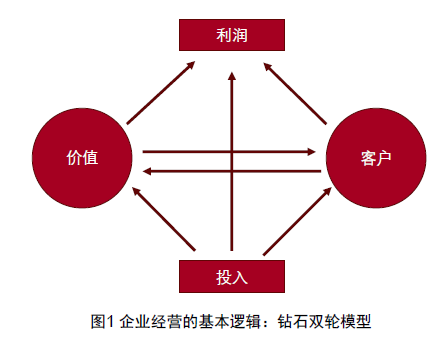

### 文化企业的竞争模式
**市场结构**：完全竞争性、完全垄断性、垄断竞争性、寡头垄断性

**市场行为**包括价格策略、产品策略、营销策略、企业并购与集团化战略。

**市场绩效**是指在一定的市场结构下，通过一定的市场行为使某一产业在产量、价格、利润、产品质量和品种以及技术条件等方面达到的现实状况 ””，反映了文化企业通过市场行为形成的资源配置和利益分配情况，包括资源配置效率、技术进步水平、规模结构效率、利润率、生产率等。其中，文化市场绩效的资源配置效率主要衡量文化市场配置文化资源的效率和效度，包括利润率和再生产率。技术进步水平包括最先进的新兴技术的采用情况、集成性技术平台的整合情况以及网络数字技术的运用水平。

**文化市场**：娱乐市场、演出市场、文物市场、音像市场、艺术品市场、书报刊市场、电影市场、文化旅游市场

### 文化企业的消费模式
文化消费的基本特点：文化消费是一种主观感知的效用消费。文化消费是一种象征性消费。文化消费是一种体验消费。文化消费是无边界的娱乐消费。文化消费是一种互动性消费。文化消费是一种社交网络式消费。

### 文化企业的营销模式
**4P-4C-3I**：Product, Price, Place, Promotion; Consumer, Cost, Convenience, Communication; Innovation, Interpersonal, Interacive

数据库营销（Database Marketing ）是 20 世纪 90 年代以来兴起的营销手段，是企业通过收集和积累消费者的海量信息，将市场影响因素进行抽象的量化，经过高度的理性、系统的统计分析和严谨的规划，利用这些信息准确进行市场的细分、定位，从而有针对性地制作营销信息，进而实施创造性、个性化的营销策略，以达到说服消费者购买产品的目的。

品牌营销（Brand Marketing ）是市场营销的高级形态和顶级手段。

社会营销（Social Marketing ）是将生产者、产品和消费者置于更大的社会背景，将消费者的欲望满足和生产者的利润追求整合进增进人类福祉的社会目标的营销理念，运用市场营销的观念达到社会公益的目的。

整合营销传播（Integrated Marketing Communication,IMC ）将营销与传播整合为一个整体的概念，认为营销行为就是传播行为，传播行为就是营销行为。

创意传播管理（Creative Communication Management CCM ）是“新媒体时代的营销传播，是以人的智慧与数字技术相结合为基础的创意传播管理”。

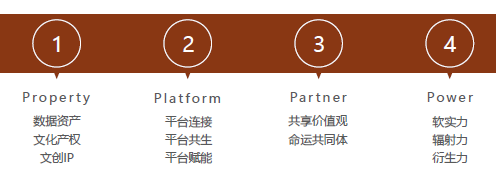

## 第十一讲：文化金融：文化产业的资本运营
### 文化金融的常规模式
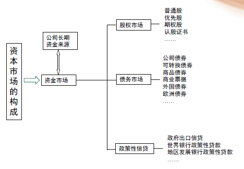

股权融资：就是投资商投入一定的资金，换取其在被投资公司或者项目的股份。股权融资的私募发售包括天使投资（Angels Invest ）、风险投资（ Venture Capital ，简称 VC ）和私募股权投资Private Equity ，简称 PE ）等以股权转让或者增资方式的融资模式。

债权融资：银行贷款、企业债券、可转换债券、过桥贷款融资租赁

### 文化金融的企业并购
生产经营与资本经营的区别：生产经营：与文化产品直接相关的广告、产品、发行、演出等方面的经营；资本运营：以资产与企业买卖为核心的经营。资本运营实现资本增值，实现企业快速增长。

资本运营的方式：（1）上市融资：对资产进行分离和重组，在证券市场挂牌交易，向社会公开募集股份。上市经营既是一种筹资和增资的手段，又是壮大企业实力，促进企业成长的利器。（2）兼并与收购：把企业当作一种商品来买卖，通过购买被收购企业的股票或资产以股票交换股票或资产以获得控股权等方式来进行。并购的因素不再是企业规模、市盈率、领导人的价值实现等，而是旨在巩固在未来经济格局和市场竞争中的战略地位。友好、明智和相对负债的兼并，多数通过证券交易来完成，产生一种增效，表现在规模经济上，通过改进销售渠道，增加市场占有率带来利润。

文化企业并购动因：（1）凸显协同效应：合理避税或减少纳税，实现优势互补；（2）实现规模经济效益

文化企业的并购方式：（1）横向兼并；（2）纵向兼并；（3）混合兼并（一个公司对与自己生产的产品不同性质和种类的公司进行的并购行为）

文化企业的并购模式：出资买断；出资控股；资产换股；承担债务；协议合并；借壳上市；托管；杠杆兼并

文化企业的并购风险：（1）兼并风险源于兼并过程中的成本膨胀和不可控；或未能取得和发挥兼并企业或被兼并企业的核心能力。环境的不确定性是风险的根本来源：系统性风险：社会风险、政治风险、经济风险；非系统性风险：经营风险、商业风险、财物风险。（2）兼并前的风险：收购一家企业所付的价格应当基于该媒体的价值评估而做出的判断。（3）兼并中的风险：如兼并企业对自身审视不足导致缺乏对竞争优势的可持续性分析；没有正确分析、评估、选择内部成长和外部扩张战略；产业结构与资源配置的失衡、政府行为和社会风险估计不足、对目标企业战略评估失当以及反兼并因素的存在和显现等都会造成企业兼并过程中的失败。（4）兼并后的风险：资产的变异、文化的鸿沟、多元化的陷阱以及企业家能力的极限和企业规模边界都会导致兼并完成后的风险，从而造成最终的兼并失败。

文化企业并购后的整合：通过一系列程序获得了被收购企业的控制权只完成了并购目标的第一步，收购完成后更为重要的是对目标企业进行有效整合，使其与企业的整体战略、经营相一致。  
并购失败原因：并购公司的主营业务实力不强；并购规模过大；对市场潜力的评价过于乐观；高估了协同效应；收购价过高；并购后整合不利。  
（1）战略调整：企业兼并之后，一般要根据集团的战略规划并兼并企业在集团战略实现过程中的地位和作用，然后对兼并企业的战略进行调整，使整个企业的各个业务部门形成一个相互关联、互相配合的战略体系。（2）业务整合：新公司根据一家公司在整个公司体系中的作用和其他部分的关系，重新设置其业务，将一些与本业务不符合的业务剥离给其他业务部门或者合并掉，将整个企业其他部门中的某些业务进行重新规划，通过整个运作体系的分工配合来提高协作，从而发挥公司兼并带来的规模效应和协同作用。（3）人事整合：公司高层管理人员的任免是否得当是并购成功与否的关键。被兼并公司的组织和人事应根据对其战略、业务等方面的设置进行整合。（4）文化整合：企业并购之后的整合是一场革命，最难的是观念的转变，企业文化（企业理想、价值、经营理念、情感和信仰的集合，表现在个体对企业团队以及自我在企业中所担任角色的心理态度和价值取向）的整合是企业并购中的重中之重。

### 文化金融的创新模式
基金化模式：文化金融的基金化交易主要体现在艺术作品，可理解为艺术品基金化，将众多投资者的基金集中并通过艺术品投资组合，尽可能控制风险，增加规模收益。艺术品基金模式还可具体分为投资型、融资型、复合型等三种艺术基金形式。

众筹化模式：借助于互联网上的融资平台，为其项目向广泛的投资者融资，每位投资者通过少量的投资金额从融资者那里获得实物（例如预计产出的产品）或股权回报（而当前国内股权回报是违法行为）。

证券化模式：文化金融的证券化交易模式又称为份额化交易模式，应遵循资产证券化的概念、本质和交易规则。证券化Securitization ）是一种金融衍生工具，指把其他金融资产组合起来，销售给投资者的过程。证券化的本质是一种金融创新，是将传统金融资产重新组合起来，以满足企业多样化的融资需求。

期货化模式：期货是与现货相对的概念，是正在生产或即将进入生产的存续于未来的商品。期货交易，是指采用公开的集中交易方式或者国务院期货监督管理机构批准的其他方式进行的以期货合约或者期权合约为交易标的的交易活动。

信贷化模式：文化金融的信贷化交易是文化资产进入信用贷款体系内实现其货币价值的交易模式，以知识产权为主的无形资产作为质押保证或质押担保。文化金融信贷化模式的主要形式是版权质押，可具体分为两种模式：版权质押保证贷款和版权质押担保贷款。

物权化模式：文化金融的物权化交易模式，即以知识产权为主的客体，透过版权等知识产权操作获利的交易模式，具代表性的有艺术授权模式、全版权模式、双边市场模式和艺术银行模式等。

### 文化金融的风险规避
（1）制定扶持性的政府资助政策：文化产业的自身特点需要政府提供多元化的混合资助模式，通过政府的政策性扶持优势，降低创业风险和投资风险，引导社会资金进入文化产业。  
（2）设置合理化的风险分担机制：文化金融是现代经济和新兴产业的融合发展，是金融业与文化产业的协同发展。文化金融的健康持续发展，离不开合理有效的风险分担机制的保障。银行贷款的抵押品在更多选择版权抵押品之后，就需要第三方信用担保机构提供担保、再担保、联合担保与保险相结合的专业服务分散风险。  
（3）设立杠杆性的文化产业基金：文化产业投资基金是指以政府相关部门发起、采取市场化运作、发挥基金放大效应、专门用于文化产业的直接投资、为文化企业提供资金支持的组合式投资基金。文化产业投资基金由于文化产业的专属性，可以降低文化企业对银行贷款和风险投资的依赖，发挥杠杆性作用，降低投资风险。  
（4）建立完善化的现代企业制度：现代企业制度的主要特征即企业的经营权和所有权相分离。在这里，企业所有者掌握企业资产所有权及选择企业经营者、审定企业重大决策的权利；企业经理人掌握企业资产的控制权、企业经营决策权和企业经济活动的组织管理权。  
（5）构建平台型的文化产业投融资服务：通过文化产业投融资服务平台建设，理顺文化企业投融资产业链，搭建文化产业投融资服务平台为核心的的文化产业多层次投融资服务体系，为各个发展时期的文化企业提供个性化融资服务。文化产业投融资服务的平台构建包括文化产业投融资服务体系构建、文化产业投融资中介服务体系构建、 文化企业投融资制度及工作流程制定、专家评价系统构建和国际合作业务开展。

## 第十二讲：文化聚落：文化产业的集群效应
### 文化产业的集聚理论
文化产业的集聚就是以企业为主的协作链条 把艺术家、 经纪人、 生产商、销售商等不同的利益相关者和价值参与者连接起来通过分工合作把文化价值转化为商业价值。

文化聚落是某种具有相似文化主题的文化资源的空间聚集，其构成要素与文化资源的类型一样，包括物质要素、非物质要素和自然要素。文化聚落分为物质层、心物层和心理层。

文化产业集群的理论模型：
- 经济地理理论：指企业、供货商、相关产业和专业化机构集中于某一地理区位，并以彼此的共通性和互补性相连结，此地理区位可以是国家、州（省）或城市的特定地区。好处：第一、降低产业交易的成本；第二、加速资本与信息在产业体系流通的速率；第三、强化商务往来的社会连结关系。
- 工业区位理论：区位因子的合理组合使得企业成本和运费最小化，企业按照这样的思路就会将其场所放在生产和流通上最节省的地点。分工理论：分工与专业化生产对产业集群形成的影响是基础性的。
- 社会分工理论：社会分工与专业化生产对产业集群形成的影响是基础性的，产业集群的形成是专业化分工下产业报酬递增的空间表现形式。
- 新竞争理论：企业的合作与适度竞争，是集群内单个企业与整个产业集群保持活力与竞争优势的决定性因素。波特是从竞争经济学的角度去研究产业集群问题。他认为产业集群对提高企业竞争力是极为重要的，这可以使企业更好地接近劳动者和公共物品以及相关机构的服务，同时有利于企业创新和产品出口。波特认为，产业集群的核心内容是其竞争力的形成和竞争优势的发挥，这是产业集群在市场经济中生存和发展的根本保障。
- 新公共领域理论：哈贝马斯认为，市民社会经历了政治社会、经济社会和文化社会三个阶段。公共领域是国家权力与市场经济之间的缓冲地带，其核心诉求是通过观念和文化的力量对抗政治权力，用观念启蒙来影响公众和政治权力持有者，不断发扬和扩大民主。哈贝马斯的公共领域理论对于规范政治权力、促进后发国家理解现代性问题、启示人类解放的途径都有着积极的作用。

创意集聚与文化产业集群：
- 文化产业集群依赖于创意的集聚。文化产业集聚越来越倚重于一种社会关系的人际网络。创意人士的参与是文化产业集群成功的重要保证，突破了单个企业的约束边界，文化产业集群管理机构的重要职责就是吸引和组织创意人士积极参与其中，创意人才是推动文化企业集聚的基石。
- 文化产业集群是文化产业实现规模经济的一种现代产业组织形式，现代文化经济大多通过文化生产的活动集群而形塑。文化产业集群是垂直分离的生产单元网络，能够灵活地应对文化商品和服务生产与消费的高度不稳定性机器中普遍存在的风险，这种集群式的文化生产网络有利于多样化技能和情感型的地方劳动力市场的崛起。

文化产业集群的空间形态：文化产业集群在空间分布和区域布局上具有不均衡性。文化产业集群具有文化园区、创意街区、产业新区和创意城市不同的存在尺度，包括微观层面的企业集聚、中观层面的行业集聚和宏观层面的区域集聚等不同的空间层次，但以文化产业园区和创意城市两种主要的空间聚集形态为发展重点。

### 文化产业的园区集聚
文化产业园区是指进行文化产业资源开发、文化企业和行业集聚及相关产业链汇聚，对区域文化及相关产业发展起示范、带动作用，发挥园区的经济、社会效益的特定区域。文化产业园区要有配套的公共服务体系，能够为进入园区的企业提供企业孵化、融资中介、技术、信息、交易、展示等公共服务。

文化产业园区的发展现状：（1）创意研发型：北京尚8文化创意产业园；（2）生产制作型：深圳大芬油画村；（3）体验交易型：北京798艺术区

文化产业园区的主要问题：园区主题同质化、经营模式单一化、商业本质地产化和园区现状空壳化等发展弊端

### 文化产业的集聚要素
文化产业园区的功能定位和空间形象：加强分工协作，共享降低成本；服务吸引企业，叠加提升品牌；传递文化传统，根植人文精神。

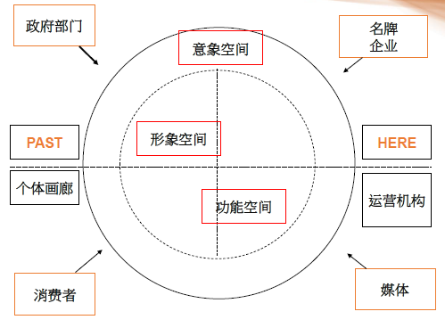

文化产业园区的关键要素：科技、人才、环境包容度  
文化产业园区准则：营造、空间、活动、组织结构、行为  

一个成功的文化园区的构成部分：活动、形式、意义
- 环境与形式：建筑环境与自然环境的综合，适合追求创意生活的环境。
- 活动与事件：街区活动、节庆活动、餐厅文化、艺术、音乐和户外活动，这些活动创造出活泼、刺激有创意的生活。
- 意义和象征：重要的会议和聚会空间；历史感和上进感；地区的身份和形象；知识的包容度；环境的地标。

### 文化产业的集群模式
文化产业集群的驱动模式：社会驱动模式（圆明园画家村）、市场驱动模式（深圳大芬村）、行政引导模式（嵩山文化创意园）、多元驱动模式（北京798艺术区）

文化产业集群的集聚动力：文化资源禀赋、制度红利扶持、高新技术支撑、人力智力资源

文化产业园区选址：第一，文化积淀深厚的地区；第二，比邻大专院校、科研机构密集的地区；第三，具备观念开放、市场活跃和政策完备的区域；第四，艺术氛围浓厚、创意生活活跃、文化设施便利的区域；第五，信息技术发达、公共交通便捷畅通的区域。

文化产业园区的运营与管理提升：第一，加强资源整合的提升；第二，加强专业能力的提升；第三，加强服务平台的提升；第四，加强产业链条的提升；第五，加强创业成长的提升；第六，加强互补性提升。

## 第十三讲：文化治理：文化产业的政策规制
### 文化治理与文化政策模式
文化治理是一种包容性治理，容纳了心理修养、知识传播、亲情伦理、社会发展等综合作用。（1）文化治理的包容性表现在公权与私权的博弈以及公平与效率的均衡。（2）文化治理的渗透性发展表现在文化治理与政治治理、经济治理、社会治理和生态文明治理的高度协同和密切融合。（3）文化治理的多元化发展表现文化创造性、文化多样性、文化民主化和文化认同性等多种价值目标的治理追求。（4）文化治理的手段具有公共手段、准公共手段和市场手段，而公共手段主要包括财政手段和政策手段。

### 文化产业政策的中国转型
从资本逻辑为导向到文化逻辑为导向：1979年到1998年，是文化市场的观念形成期及文化市场的初步培育期。1998年到2002年，是文化产业观念的形成期和文化体制改革的准备期。2003年至2011年是文化体制改革的全面推动期和文化产业的快速发展期。2012年至今，是中国文化体制的深化改革期和文化产业的市场扩张期。

### 文化产业政策的绩效评价
文化产业政策的评估要以公众参与度(Participation) 、可预见性(Predictive)、程序公正性（Procedural Fairness）为评估原则，以效果（Effectiveness）、效率（Efficiency）、效能（Efficacy）及其充分性（Adequacy）的判断标准，以效能、效率、适当性（Adequacy）、公平性（Equity）、反应度（Reactivity）和执行能力（Executive capacity）等七项标准为政策评估的绩效指标。

文化产业政策评估可以分为政策系统、政策过程和政策结果等三大评估标准。
- 产业活动维度：从产业价值流动的角度来看，完整的文化产业包括数字素材、数字内容产品、产品提供商、传播载体、消费终端五个环节。结合一般产业活动的特点，将数字素材到数字内容产品归纳为数字内容产品的研发阶段。数字内容产品经过内容提供商到传播载体阶段归纳为数字内容产品的生产阶段。消费终端以及后续的消费者消费归纳为数字内容产品的消费阶段，再加上贯穿始终的投资的推动作用。本分析框架的产业活动维度由投资、研发、生产和消费组成。
- 政策效力维度：政策的效力维度描述了政策工具之间的效力等级关系。由于政府颁布的政策本身是有层次或等级划分的，因而其效力当然具有层次或等级性。我国正式颁布的政策的效力层次是多层次性的结构体系。依据政策工具颁布的主体，对政策工具进行识别，将全部政策工具划分法律、行政法规、部门规章、司法解释和行业规定五个类目，建立相对应的政策工具效力分析维度。
- 政策工具维度：三种类型：供给型政策工具（人才资源培养、科技信息支持、基础设施建设、资金投入、公共服务）、环境型政策工具（目标规划、金融支持、税收优惠、法规管制、策略性措施）、需求型政策工具（政府采购、外包、贸易管制、海外机构管理）。

### 文化产业政策的治理建议
文化产业政策的治理策略：第一，要推动各级政府形成对文化产业发展的观念治理。第二，要破除中央各部委多头管理文化产业发展的机制治理。第三，要创新现阶段文化产品内容管理的模式治理。第四，要推动国有文化企业基础角色、中小微企业共生发展的企业治理。第五，要提高文化产业增长方式、商业模式的效益治理。

文化产业政策的治理重点：第一，提高文化产业政策中政策效力较高的条例、法律政策的出台。第二，调整文化产业政策在政策工具类型的合理布局和产业活动环节的合理分布。第三，增强文化产业政策在文化事业与文化产业之间资源转换的枢纽功能。第四，加强文化产业政策成本的核算和政策绩效的评估。

数字内容产业政策治理重点示例：
- 第一，调整环境型政策工具结构：应减少法规管制类工具的使用。法规管制类工具不能激发文化产业从事创新活动的动力，也无法直接刺激市场需求。政府部门应当颁布着力于为数字内容产品创作者创造宽松适宜的创作环境，鼓励原创产品生产的政策工具。加强在职培训，尊重知识、尊重人才，建立全新的人才管理机制，特别是应有效地利用激励机制，调动从业者的积极性和创造性。我国政府应重视财政、金融、税收工具的使用，针对文化产业不同发展阶段、不同类型的数字内容企业颁布能够适应其发展需要的政策工具，形成多元化的投融资渠道，满足企业对资金的需求，针对行业发展的风险制定相应的税收优惠政策。
- 第二，加强供给和需求型工具的使用：颁布相应的科技信息支持工具，通过收集整理国内外文化产业信息和数据，通过建设信息传播网站、数据库资料库等，加强文化产业信息交流，为文化产业发展提供公共信息服务和专业咨询服务，引导产业发展。加强采购和外包工具使用，加大对国内数字内容产品的采购数量。加大政策采购力度，重点扶持拥有自主知识产权的数字内容企业，根据产业发展阶段及时调整采购支持力度。同时政府应合理使用贸易管制工具，在保护国内企业发展的同时，加大引进国外先进技术和优质产品的力度，达到先进技术转移和管理经验引进的目的。
- 第三，完善政府管理方式和政策工具体系：加强文化产业专门立法工作，将文化产业发展纳入法制化轨道，构建文化产业发展的纲领性法律文件。在更高级别的层次上制定约束力更强的法律法规，同时鼓励行业协会颁布适用于行业自身的行业规定。应在政府统一管理部门的引导下，消除不同效力层次上的政策不一致现象，避免因缺乏宏观指导原则和法律、实施细则操作性差而导致的政策执行不到位的问题，更好的发挥“高-中-低”层次的政策工具体系协同效应。

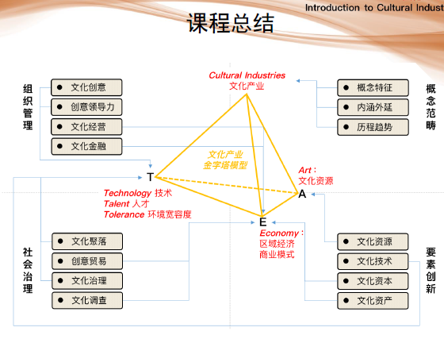